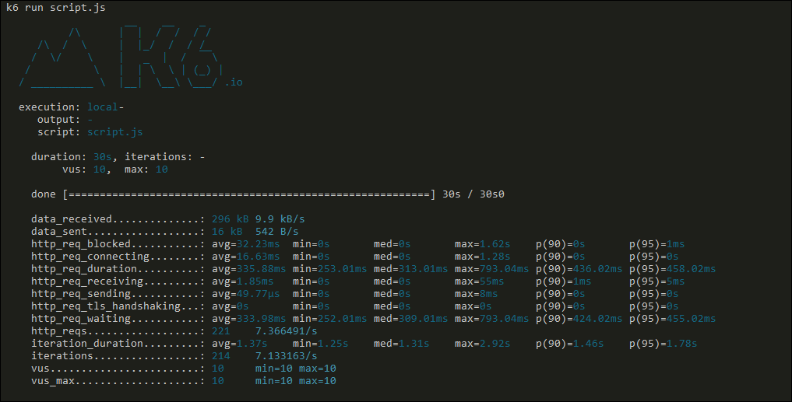

# **wiki** _(K6-POC)_  📚

🦮 This is a mini Wiki for quick help.

---

# Sample Result run on terminal

- `k6 run --vus 5 --duration 10s cli_script.js`

---

- `k6 run script.js`

---
Let's go back to Previous(main) [README.md]

---

[\\]: <> (This is a commented section and should not be visible in README file)

[README.md]: <https://github.com/eaccmk/K6-POC>

